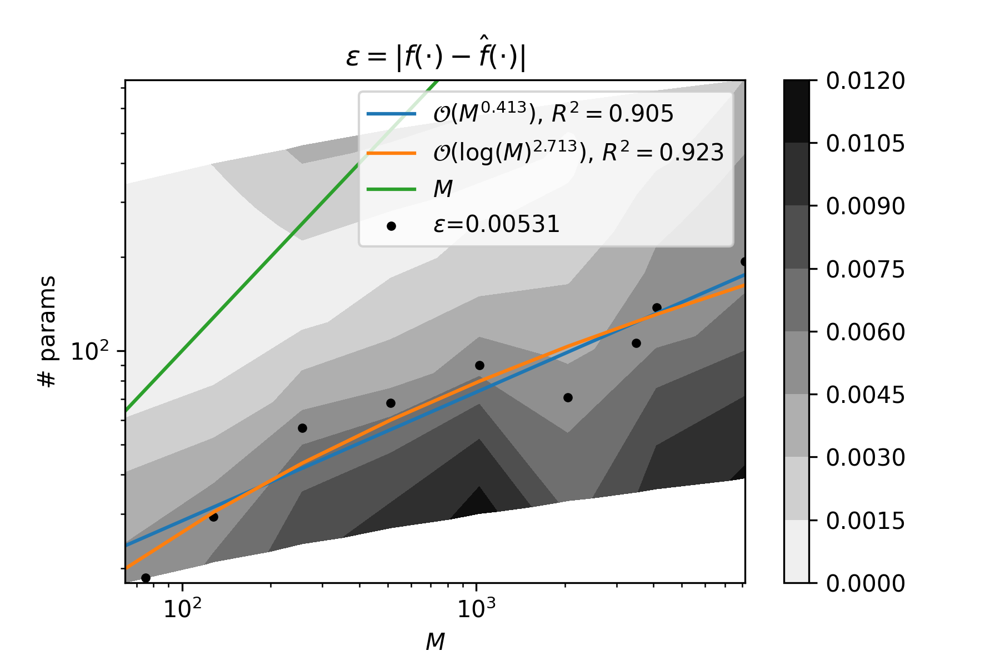

# Numerical Simulation on reduced MNIST dataset

## Setting

### Simulation Setting

```python
test_size = 14780-2**13 #2**13
n_steps = 2**10
stepsize = 0.001
n_feature = 10
n_qubits_list = np.arange(6, 13+1, dtype=int) # 6 7 8 9 10 11 12 13
n_layers_list = np.arange(1, 19+1, 2, dtype=int) # 1 3 5 7 9 11 13 15 17 19
C=10**3
lamda=10**3
dir_name = 'numerical_simulation4'
sampling_seed=19782
```

### Quantum Setting

```python
from qiskit.circuit.library import ZZFeatureMap
import pennylane as qml

feature_map = ZZFeatureMap(feature_dimension=n_feature, reps=2, entanglement='linear')
device:qml.Device = qml.device('lightning.qubit', wires=n_qubits)
def var_form(params):
    qml.StronglyEntanglingLayers(params, wires=device.wires)
```

## Result

```python
plt.contourf(2**N_qubits, N_params, epsilon_summary, cmap='binary')
plt.plot((2**N_qubits)[0], (2**reg__.intercept_*(2**N_qubits)**reg__.coef_[0])[0], label=r"$\mathcal{{O}}(M^{{{:.3f}}})$, $R^2={:.3f}$".format(reg__.coef_[0], reg__.score(2**lv[:, 0].reshape(-1, 1), lv[:, 1])))
plt.plot((2**N_qubits)[0], (2**reg_.intercept_*N_qubits**reg_.coef_[0])[0], label=r"$\mathcal{{O}}(\log(M)^{{{:.3f}}})$, $R^2={:.3f}$".format(reg_.coef_[0], reg_.score(lv[:, 0].reshape(-1, 1), lv[:, 1])))
plt.plot((2**N_qubits)[0], (2**N_qubits)[0], label=r'$M$')
plt.colorbar()
plt.plot(2**v[:, 0], v[:, 1], label = r'$\epsilon$={:.5f}'.format(level))
plt.ylabel('# params')
plt.ylim([None, np.max(N_params)])
plt.xlabel(r'$M$')
plt.xscale('log')
plt.yscale('log')
plt.legend()
plt.title(r"$\epsilon=\left|f(\cdot)-\hat{f}(\cdot)\right|$")
plt.savefig(dir_path / 'readme_figure.png', dpi=300)
```


